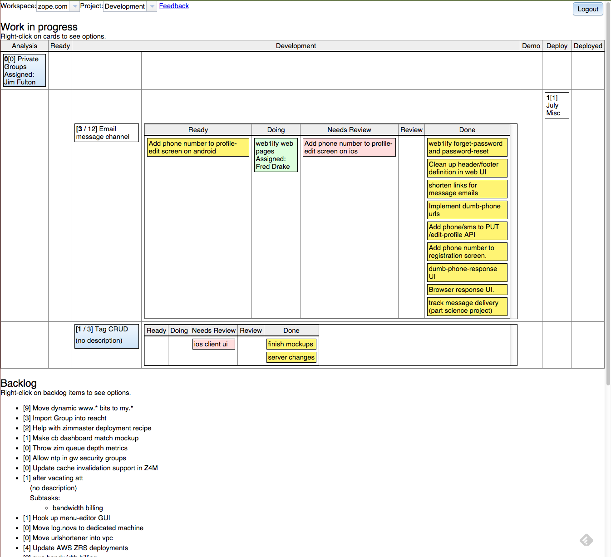

Two-tiered Kanban on Asana
==========================

.. contents::

A two-tiered kanban models processes with nested subprocesses.  A
typical example is a product-develolpment process with a nested
software-development process.

Why two-tiered kanban?  The goal of a lean organization is to provide
value to its stakeholders.  The efforts of the organization must
remain focussed on providing value.  Typical kanban boards focus on
development, but products don't provide value until their in the hands
of customers.  In the case of software development, software doesn't
provide value until it's deployed to and being used by customers.
While in the development cycle, it's important to track the progress
of individual components, it's also critical to track the progress of
a product after development to get it in the hands of users as soon as
possible.  Two-tiered kanban allows us to track progress of individual
components during development and also allows us to track the full
lifecycle of a product or feature until it's in the hands of
customers.

This application uses an Asana *project* to model a development team.
Top level *tasks* model *releases*. *Subtasks* model release tasks.
Asana tags are used to represent task states.  Tags will be created in
Asana to match the model.

The basic idea is that it's not enough to have a development Kanban
process. The process must also include higher-level activities, like
analysis, demo/acceptance testing and, most importantly,
deployment. Development provides no value until the resulting software
is used.

You can drag releases and tags around to represent progress. You can
also take tasks to work on and mark tasks as blocked.

Setup
=====

Packaging this application for deployment is outside the scope of this
document. Some high-level notes:

- You'll need an Asana workgroup and project set up.

  Each user of the Kanban will need an account and access.

- Edit ``buildout.cfg`` and update the following options in the
  ``buildout`` section as needed:

  port
    The port the server should listen on.

  url
    This is the URL at which the Kanban will be made available. This is
    used for Persona authentication.

  authorized
    A regular expression tested against the authenticated email address
    from Persona.  Typically, this described a domain used by an
    organization (e.g. ``@zope\.com$`` for the ``zope.com`` domain).

  To build::

    python bootstrap.py
    bin/buildout

  To start the server::

    bin/server start

- The application uses web sockets to update clients in real time.

  Websockets use long-running connections, so whatever infrastructure
  you use, needs to support long-running connections.

- Because the server caches heavily, you should only use one server
  instance.  Because this is typically used for internal development
  projects, a single server, in our experience provides enough
  availability and performance.

Authentication/Authorization
----------------------------

Users need to authenticate with the Kanban *and* with Asana. The
Kanban uses `Persona <https://www.mozilla.org/en-US/persona/>`_.
Authorization is by email address.  To set this up, edit the ``url``
and ``authorized`` options, as described above.

After logging in with Persona, you'll be prompted for an Asana API key
for whatever Asana workspace you'd like to use.

Implementation notes
====================

This application is implemented using Python on the server, using the
`Bobo <http://bobo.digicool.com>`_ micro-framework. It uses
`gevent=websocket <https://bitbucket.org/Jeffrey/gevent-websocket/>`_
to provide websocket support.  This allows boards to be updated as
changes are made.

The client is implemented using (a fairly old version of) the `Dojo
<http://dojotoolkit.org/>` JavaScript framework.

Using Asana as a backend allowed for fairly quick early prototyping
and iterative development, but required a lot of caching work to
overcome limitations in the API for this kind of application.

Future versions of the Kanban will likely use a database back-end and
use `generational sets <https://github.com/zc/generationalset>`_.

Status/Changes
==============

To my amazement, this still works, at least from a cursory examination.
There aren't automated tests, which would make an assessment more reliable.

This project makes heavy use of Asana APIs, which have become slower
over time.  Also, the APIs, at least as used here, aren't a very good
fit for this type of application, as they don't support caching well.
Using Asana provided a number of advantages:

- Leverage existing task CRUD, facilitating initial iterative development.

- Integrate with existing uses of Asana.

Future versions are likely to use a database backend, rather than Asana.

0.3.0 (2013-04-28)
------------------

This is a pretty major refactoring to provide server-side caching to:

- Reduce requests to Asana (and the risk of having excessive requests
  rejected)

- Live update so you don't have to reload to see changes users make
  through the kanban board.

The server-side caching without notifications from Asana necessitated
adding task CRUD in the kanban board.

Now have a model-based architecture. The workflow is no-longer
expressed in the code, but through a JSON-formatted model. (In the
future, we'll make it possible to pass the path to a model definition
to the server process.)

Lots of UI improvements.
